

  
  

# Hi, I'm Jaco

### Product engineer · Local AI developer · Audio and creative-software builder

I design complete Windows products that combine native performance, practical
AI, thoughtful interfaces, and safe automation.

[Featured work](#featured-work) · [Skills](#skills-and-engineering-focus) ·
[Current focus](#what-im-building-now) · [Connect](#lets-connect)

---

## Building useful software from idea to release

I build under **Infin8 Apps**, with hands-on ownership across product design,
architecture, implementation, testing, packaging, and technical presentation.
My work spans realtime audio, local AI assistants, AI-assisted video creation,
Windows diagnostics, speech systems, visual website reconstruction,
browser automation, and computer vision.

The common goal is simple: turn technically difficult workflows into software
that people can understand, control, and use on their own computers.

| Area | What I build |
| --- | --- |
| **Local AI** | Private assistants, voice conversations, tool use, project knowledge, speech recognition, and local model orchestration. |
| **AI video systems** | AI-assisted editing, format adaptation, timeline automation, YOLO detection/tracking, and locally optimized `.pt`, `.onnx`, and TensorRT `.engine` inference. |
| **Realtime audio** | Native DSP, voice transformation, vocal production, pitch processing, MIDI, metering, and standalone/VST3 delivery. |
| **Windows products** | C++, Rust, Qt, Tauri, Electron, React, Python, WebView2, local services, packaging, and hardware-aware tools. |

> **Open to:** product-engineering opportunities, technical collaboration,
> private demonstrations, partnerships, and investment conversations.

## Featured work

### Infin8 Suite — flagship audio products

These are the four primary Infin8 Suite products: focused Windows audio tools
with native realtime processing, embedded interfaces, persistent state, shared
licensing, and repeatable standalone/VST3 packaging.

<table>
  <tr>
    <td width="50%" valign="top">
      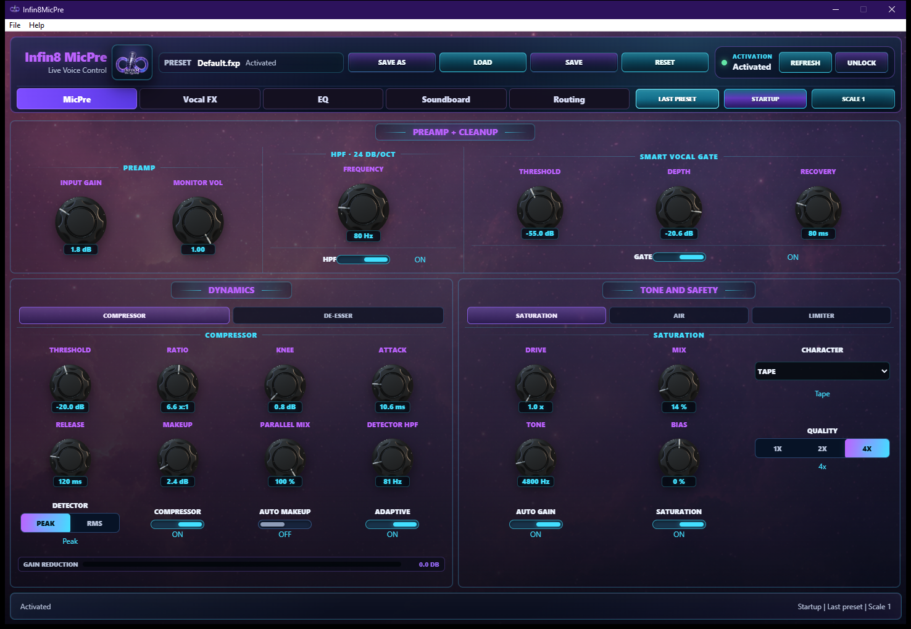
      <h3>Infin8 MicPre</h3>
      
<strong>A complete vocal front end in one workspace.</strong>

      
Combines gain staging, cleanup, dynamics, tone shaping, output safety,
      vocal effects, parametric EQ, and a performance soundboard for music,
      streaming, podcasting, and voiceover.

      
<strong>Engineering:</strong> realtime C++ DSP, iPlug2, WebView2,
      MIDI, metering, host automation, preset state, licensing, and
      standalone/VST3 delivery.

    </td>
    <td width="50%" valign="top">
      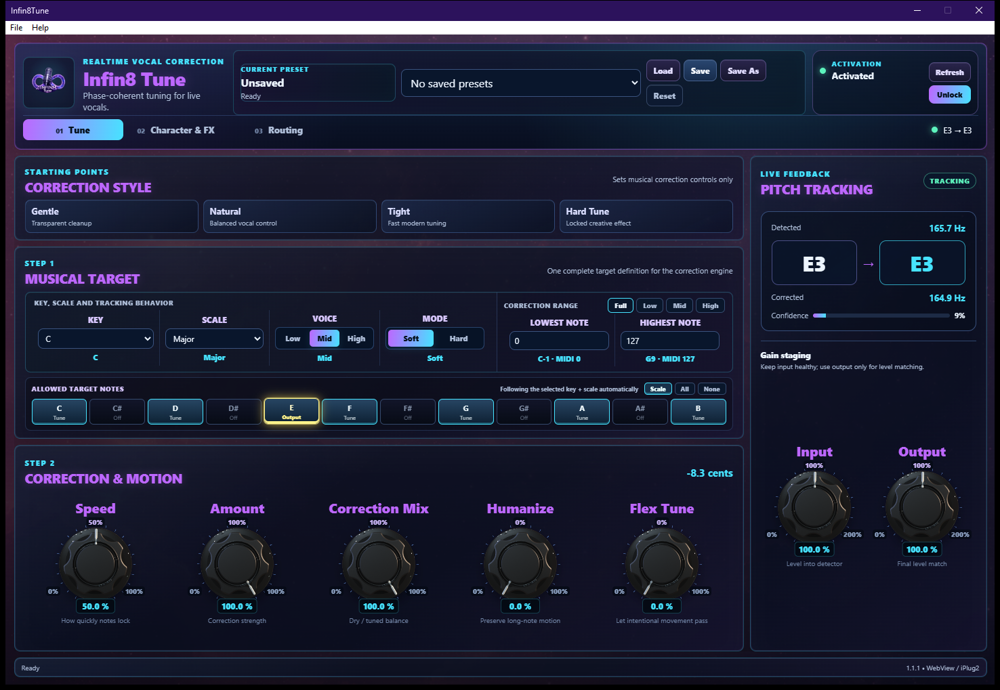
      <h3>Infin8 Tune</h3>
      
<strong>Realtime vocal correction with musical control.</strong>

      
Provides key-and-scale targeting, correction character, pitch-motion
      controls, live tracking feedback, vocal effects, and flexible monitoring
      for performance and studio use.

      
<strong>Engineering:</strong> realtime pitch analysis and correction,
      C++ DSP, iPlug2, WebView2, automation, metering, preset recall, and
      standalone/VST3 delivery.

    </td>
  </tr>
  <tr>
    <td width="50%" valign="top">
      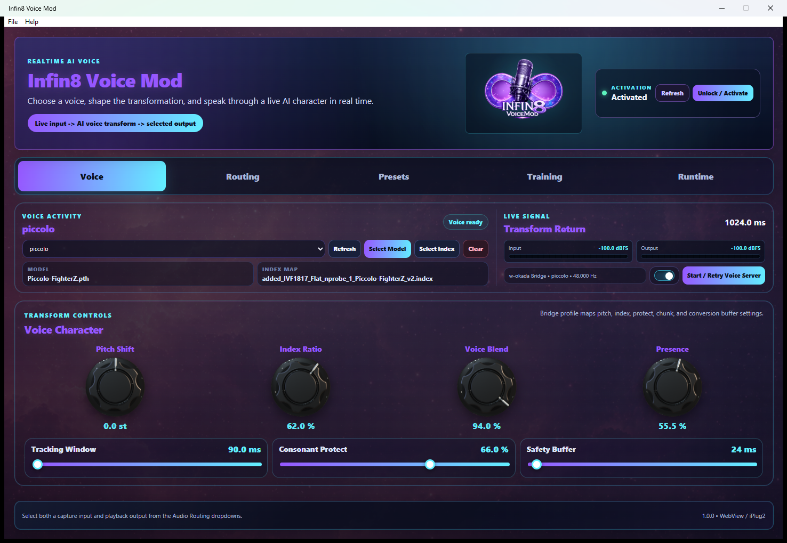
      <h3>Infin8 Voice Mod</h3>
      
<strong>Realtime voice transformation with a complete local workflow.</strong>

      
Turns trained voice packages into a usable production system with
      voice-library management, conversion controls, device routing, presets,
      runtime configuration, telemetry, and assisted model training.

      
<strong>Engineering:</strong> native C++ host, iPlug2, WebView2, RVC,
      PyTorch and ONNX runtimes, GPU profiles, device fallback, content
      packaging, and shared licensing.

    </td>
    <td width="50%" valign="top">
      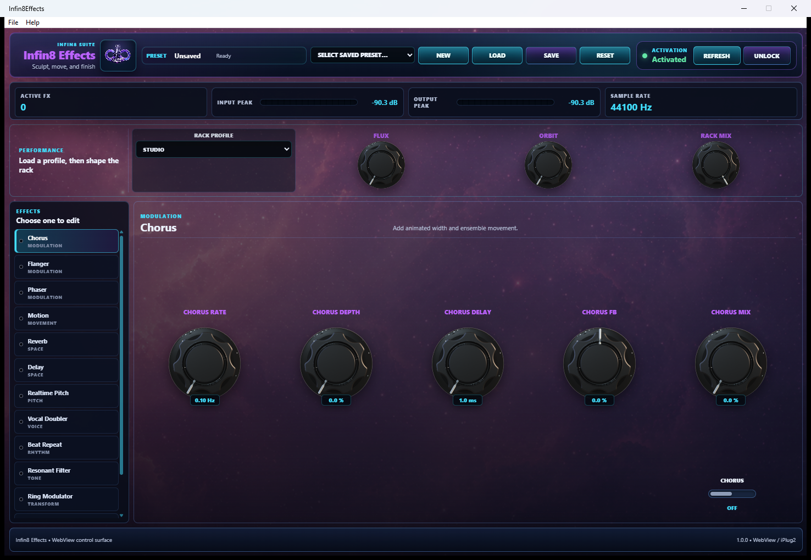
      <h3>Infin8 Effects</h3>
      
<strong>Sculpt, move, and finish sound in one effects environment.</strong>

      
Brings dynamics, saturation, limiting, modulation, space, delay, and
      an eight-band parametric EQ into a clear creative signal chain.

      
<strong>Engineering:</strong> modular realtime C++ DSP, iPlug2,
      WebView2, host automation, visual metering, preset serialization, and
      standalone/VST3 delivery.

    </td>
  </tr>
</table>

### Priority AI and creative products

<table>
  <tr>
    <td colspan="2" width="100%" valign="top">
      
      <h3>Infin8 Assistant — Local AI Development Control Panel</h3>
      
<strong>A private, free-to-run local assistant for conversation,
      focused work, and project oversight.</strong>

      
Infin8 Assistant combines natural text and voice conversations with
      projects, applications, tasks, work sessions, calendars, notes, releases,
      repository health, and local development services. It searches registered
      project knowledge, explains current work, helps plan next actions, and
      performs supported updates through explicit approval controls.

      
Models, speech, operational records, and source context can remain on
      the user's machine through Ollama, Whisper, Kokoro, and local SQLite
      storage.

      
<strong>Built with:</strong> Tauri, Rust, React, TypeScript, SQLite,
      Ollama, Whisper, Kokoro, Git integration, Windows audio routing, and
      approval-gated assistant tools.

    </td>
  </tr>
  <tr>
    <td colspan="2" width="100%" valign="top">
      
      <h3>Infin8 Editor — AI-Assisted Video Creation Studio</h3>
      
<strong>Create, adapt, and finish widescreen and social video from one
      local-first editing workspace.</strong>

      
Infin8 Editor combines a multitrack timeline, video and Premiere
      project import, smart media relinking, captions, titles, looks, audio
      controls, live preview, project persistence, and H.264 export. Canvas
      presets support 16:9 widescreen, portrait shorts, vertical reels, square
      posts, lyric videos, music videos, and promotional content.

      
Its AI layer can use local Ollama or an optional OpenAI connection to
      plan first cuts and apply validated, undoable timeline commands. Imported
      Premiere projects are never overwritten and generated code is never
      executed.

      
<strong>Built with:</strong> Electron, React, TypeScript, Remotion,
      Mediabunny, Ollama, optional OpenAI assistance, Premiere migration,
      sandboxed media handling, and deterministic rendering.

    </td>
  </tr>
  <tr>
    <td colspan="2" width="100%" valign="top">
      
      <h3>Infin8 Website Builder — Visual Website Reconstruction Studio</h3>
      
<strong>Open real website folders, preserve their design, and evolve
      them through a controlled local editing workflow.</strong>

      
Infin8 Website Builder is an actively developed desktop workspace for
      loading existing websites, reconstructing pages into editable components,
      preserving assets and brand styling, selecting page elements, adjusting
      properties, previewing responsive layouts, and exporting production-ready
      site files.

      
Current development is focused on direct canvas movement and resizing,
      keyboard-based text editing, responsive transform controls, accurate style
      retention, and reliable round-trip export.

      
<strong>Built with:</strong> Tauri, Rust, React, TypeScript, HTML/CSS
      project analysis, component modelling, responsive preview, local
      filesystem access, automated quality gates, and standalone Windows
      packaging.

    </td>
  </tr>
</table>

### More products and applied systems

<table>
  <tr>
    <td width="50%" valign="top">
      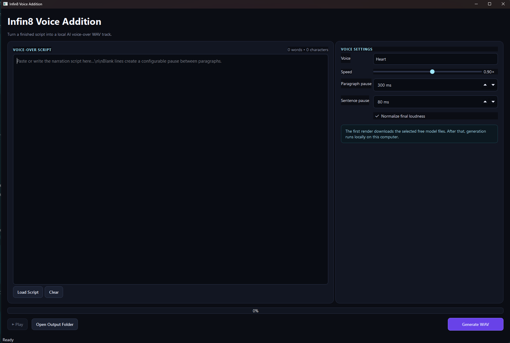
      <h3>Infin8 Voice Addition</h3>
      
Turns scripts into local AI voice-over WAV files with voice selection,
      pacing controls, loudness normalization, playback, and verified
      standalone packaging.

      
<strong>Built with:</strong> Python, PySide6, Kokoro, Misaki, PyTorch,
      local model caching, and audio normalization.

    </td>
    <td width="50%" valign="top">
      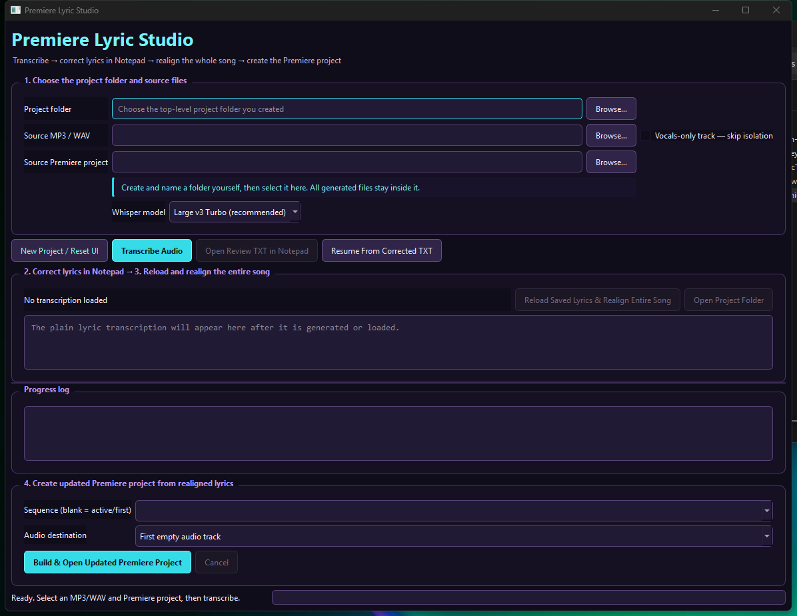
      <h3>Premiere Lyric Tool</h3>
      
Transforms audio into reviewed, time-aligned lyrics and a safely copied
      Adobe Premiere project ready for caption styling and export.

      
<strong>Built with:</strong> Python, PyQt6, Whisper, CTranslate2,
      Demucs, forced alignment, and SRT automation.

    </td>
  </tr>
  <tr>
    <td width="50%" valign="top">
      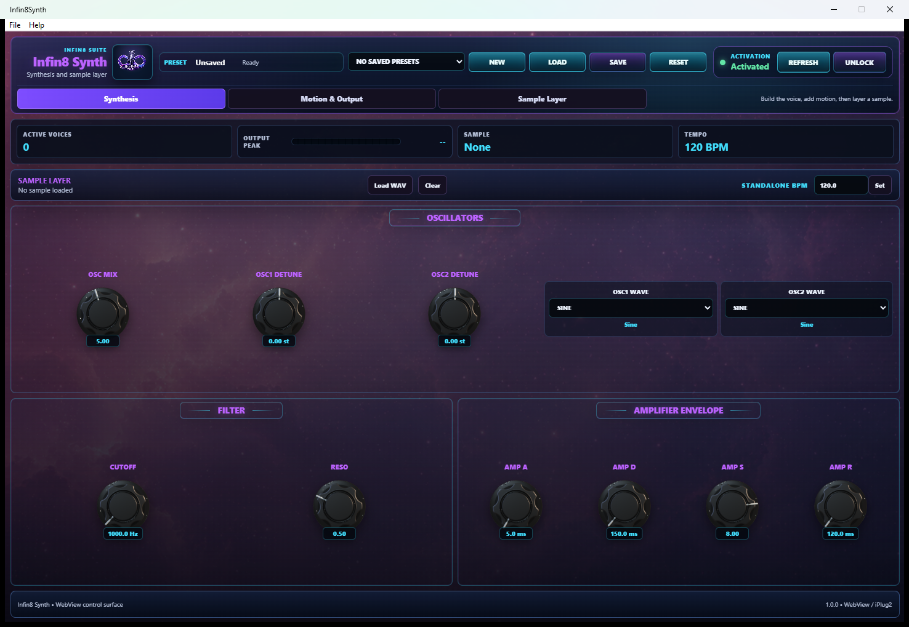
      <h3>Infin8 Synth</h3>
      
A developing polyphonic synthesis and tempo-aware sample system with
      modulation, performance controls, and preset state.

      
<strong>Built with:</strong> C++ DSP, iPlug2, WebView2, MIDI, and
      standalone/VST3 packaging.

    </td>
    <td width="50%" valign="top">
      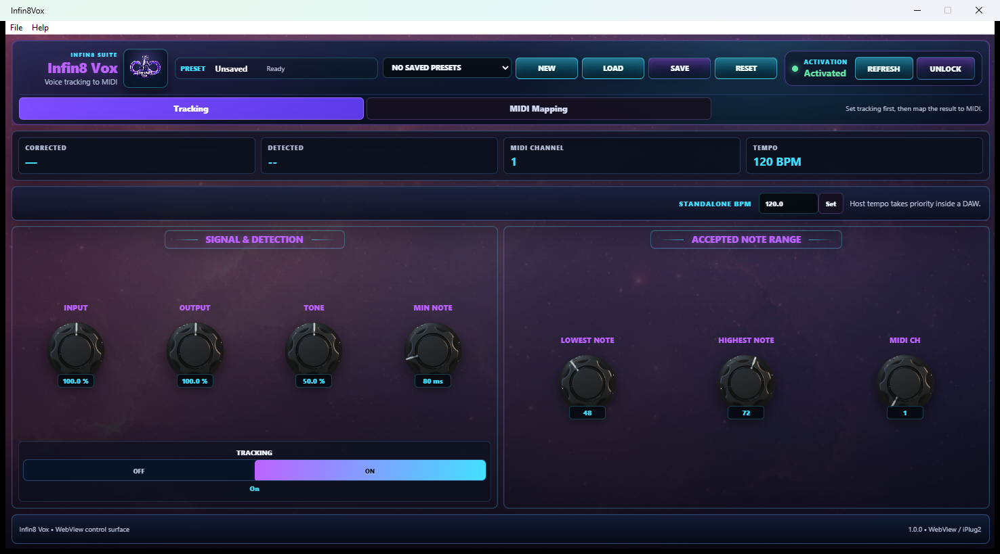
      <h3>Infin8 Vox</h3>
      
A developing voice-to-MIDI system that converts singing and humming
      into playable musical expression.

      
<strong>Built with:</strong> realtime pitch tracking, MIDI output,
      C++ DSP, iPlug2, WebView2, and host automation.

    </td>
  </tr>
  <tr>
    <td width="50%" valign="top">
      
      <h3>Infin8 Optimizer</h3>
      
A native Windows dashboard for hardware visibility, bounded
      benchmarks, diagnostics, cleanup, and guided performance optimization.

      
<strong>Built with:</strong> C++17, Qt 6, CMake, Windows APIs,
      Direct3D 11, and PowerShell.

    </td>
    <td width="50%" valign="top">
      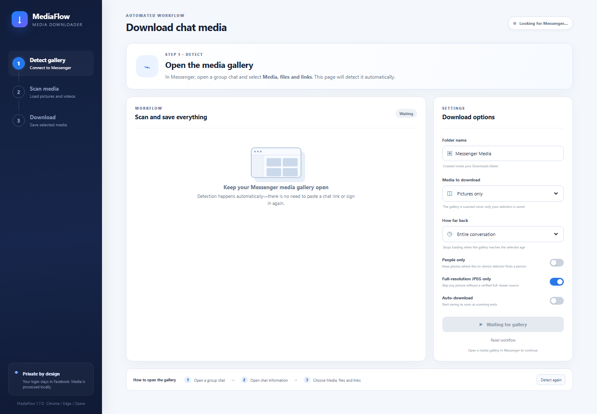
      <h3>Messenger Media Downloader</h3>
      
Organizes selected conversation media with filtering, duplicate
      prevention, and private on-device people and object detection.

      
<strong>Built with:</strong> JavaScript, Manifest V3, MediaPipe,
      TensorFlow Lite, EfficientDet, browser APIs, and local inference.

    </td>
  </tr>
  <tr>
    <td width="50%" valign="top">
      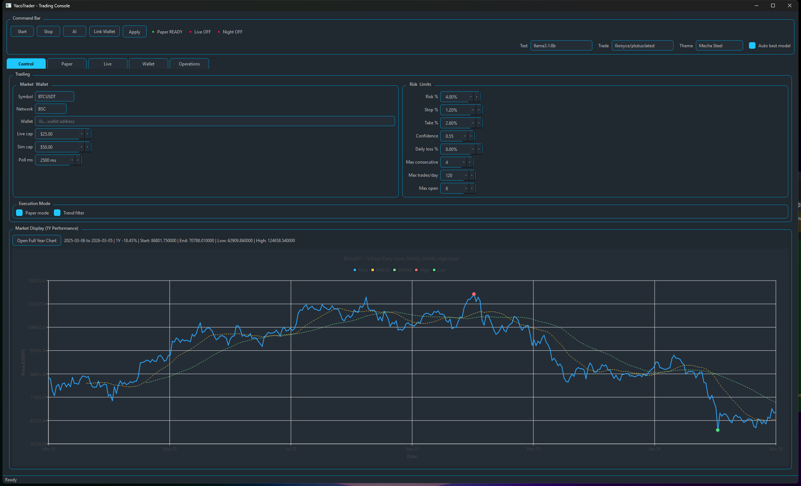
      <h3>Yaco Trader</h3>
      
An experimental research workstation for paper execution, market
      analysis, local-AI-assisted operations, persistence, and simulation.

      
<strong>Built with:</strong> C++17, Qt 6, SQLite, React, Vite,
      WebSockets, ethers, and Ollama.

    </td>
    <td width="50%" valign="top">
      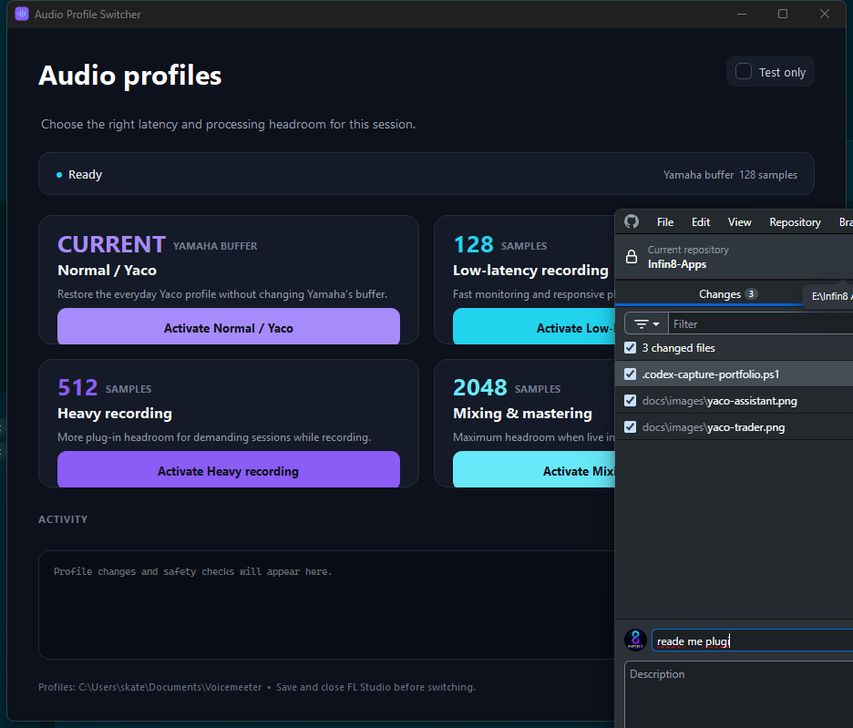
      <h3>Audio Profile Switcher</h3>
      
A guarded desktop launcher for switching Voicemeeter and Yamaha
      configurations between recording, production, and mastering sessions.

      
<strong>Built with:</strong> Python, PyQt6, Windows process and
      registry APIs, validation, dry runs, and operational logging.

    </td>
  </tr>
</table>

  

#### Network Checker / Infin8 Network Sentinel

An explainable local network diagnostics and cyber-hygiene workspace. It
correlates throughput, process-attributed endpoints, listening services,
connection state, hardware, adapters, packet health, DNS, and outbound-route
checks without inspecting private payloads or presenting heuristics as proof.

**Built with:** Python, `psutil`, Tkinter, IPv4/IPv6 parsing, threaded
diagnostics, explainable scoring, CLI/JSON integration, and automated tests.

> Yaco Trader is an R&D system, not financial advice or a promise of
> performance. Paper simulation is its intended evaluation path.

## Skills and engineering focus

| Focus | Practical experience |
| --- | --- |
| **Product engineering** | Product definition, UX, architecture, implementation, integration, testing, packaging, release workflows, and technical communication. |
| **Local AI systems** | Ollama, llama.cpp, speech-to-text, text-to-speech, RVC voice conversion, model/runtime health checks, GPU profiles, local memory, and approval-gated tools. |
| **AI video and computer vision** | Remotion-based video systems, MediaPipe, TensorFlow Lite, EfficientDet, YOLO detection/tracking, PyTorch tensor pipelines, CUDA acceleration, ONNX portability, and TensorRT deployment. |
| **Realtime audio** | Modern C++, DSP, pitch analysis, MIDI, low-latency routing, metering, preset state, iPlug2, VST3, and standalone applications. |
| **Desktop and web UI** | Qt 6, PySide6/PyQt6, Tauri, Rust, Electron, React, TypeScript, Vite, WebView2, and accessible operational interfaces. |
| **Windows integration** | Process and registry APIs, audio devices, GPU-aware workloads, local HTTP services, PowerShell automation, installers, and self-contained packaging. |
| **Safe automation** | Human approval, source-copy workflows, undoable edits, paper modes, dry runs, bounded scans, validation gates, logs, and recoverable outputs. |

### Local AI-video model pipeline

I have worked with Torch and PyTorch tensor pipelines, CUDA GPU acceleration,
PyTorch `.pt` models, exported and integrated ONNX `.onnx` models, and created
TensorRT `.engine` files optimized for the available local GPU hardware. These
model formats support low-latency video programming and YOLO-based detection
and tracking without requiring footage to leave the local machine.

I apply the resulting detections as structured, reviewable data for product
and inventory recognition, work-system records, operational analysis, and
security-event review. The emphasis is on local processing, traceable results,
bounded retention, and human control over how detections are stored or used.

### Technology

  
  
  
  
  
  
  
  
  
  
  
  

`Ollama` · `llama.cpp` · `Whisper` · `Kokoro` · `Torch tensors` · `PyTorch .pt` ·
`CUDA` · `ONNX .onnx` · `TensorFlow Lite` · `TensorRT .engine` · `YOLO` ·
`MediaPipe` · `EfficientDet` ·
`CTranslate2` · `Demucs` · `RVC` · `Remotion` · `Mediabunny` ·
`HTML/CSS project analysis` · `iPlug2` ·
`VST3` · `WebView2` · `SQLite` · `CMake` · `PowerShell`

## What I'm building now

- Advancing Infin8 MicPre, Tune, Voice Mod, and Effects as the flagship audio
  product line.
- Developing Infin8 Assistant as a private local AI partner for work and
  project operations.
- Expanding Infin8 Editor across widescreen and social-video production.
- Developing Infin8 Website Builder for faithful visual editing of existing
  websites, direct canvas controls, and controlled production export.
- Expanding YOLO detection and tracking through locally built `.pt`, `.onnx`,
  and hardware-optimized TensorRT `.engine` pipelines for video, inventory,
  work-system, and security applications.
- Turning specialized creative workflows into understandable, repeatable,
  packaged Windows products.

## Portfolio access

The product portfolio is maintained as a private presentation and technical
review suite rather than a public source dump. For qualified employer, partner,
or investor conversations, I can provide guided demonstrations, architecture
walkthroughs, selected source review, and deeper product case studies.

## Let's connect

If you are building ambitious desktop software, local AI systems, creative
tools, audio products, or intelligent automation, I would be glad to talk.

  

  <strong>Product demonstrations · Engineering opportunities · Partnerships · Investment</strong>

---

  Designed and engineered by <strong>JacoInfin8</strong> 
  Copyright © 2026 JacoInfin8. All rights reserved.

