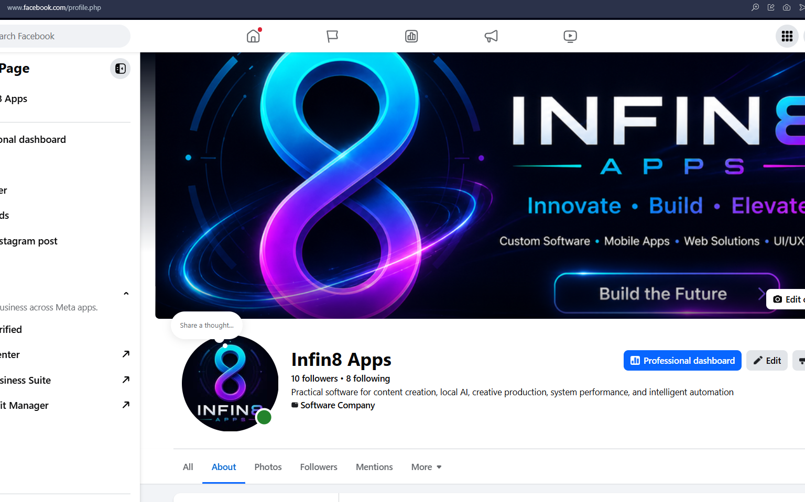

  
  

# Hi, I'm Jaco

### Product engineer and creator of Infin8 Apps

I design and build local-first software across realtime audio, AI, creative
production, Windows systems, browser automation, and applied research.

[Featured products](#featured-products) ·
[Engineering focus](#engineering-focus) ·
[Technology](#technology) ·
[Let's connect](#lets-connect)

---

## Building useful software from idea to working product

I work across product design, native desktop engineering, AI integration,
automation, and operational safety. My projects begin with workflows I
understand firsthand and grow into focused tools that make technically complex
work clearer, faster, and safer.

Today, that work lives under **Infin8 Apps**: a portfolio of production audio
software, independent Windows applications, browser tools, and intelligent
workflow systems prepared for employer, partner, and investor review.

> **Available for:** product engineering opportunities, technical
> collaborations, private portfolio demonstrations, and investment
> conversations.

## Featured products

### Flagship audio products

These are my two most developed products: end-to-end Windows audio applications
that combine realtime processing, embedded interfaces, persistent state,
licensing, packaging, and creator-focused workflows.

<table>
  <tr>
    <td width="50%" valign="top">
      
      <h3>Infin8 MicPre</h3>
      
<strong>A complete vocal front end in one focused workspace.</strong>

      
Brings gain staging, cleanup, dynamics, tone shaping, output safety,
      vocal effects, parametric EQ, and a performance soundboard into one
      coherent signal path for music, streaming, podcasting, and voiceover.

      
<strong>Engineering:</strong> realtime C++ DSP, iPlug2, WebView2,
      host automation, metering, MIDI input, preset serialization, shared
      licensing, and standalone/VST3 packaging.

      
<em>Private product demonstration and technical walkthrough available.</em>

    </td>
    <td width="50%" valign="top">
      
      <h3>Infin8 Voice Mod</h3>
      
<strong>Realtime voice transformation with an end-to-end voice workflow.</strong>

      
Turns local trained voice packages into a playable production tool
      with voice-library management, live conversion controls, device routing,
      complete preset recall, runtime configuration, and assisted training.

      
<strong>Engineering:</strong> native C++/iPlug2 host, embedded
      WebView2 UI, RVC model-runtime orchestration, GPU profiles, device
      fallback, latency telemetry, content packaging, and shared licensing.

      
<em>Private product demonstration and technical walkthrough available.</em>

    </td>
  </tr>
</table>

### More products

<table>
  <tr>
    <td width="50%" valign="top">
      
      <h3>Yaco Assistant</h3>
      
A local desktop AI workspace for private chat, coding, tool use, and
      optional inference-time reasoning across optimized local model
      runtimes.

      
<strong>Built with:</strong> C++17, Qt 6, Python, CUDA, llama.cpp,
      Ollama, and OptiLLM.

    </td>
    <td width="50%" valign="top">
      
      <h3>Premiere Lyric Tool</h3>
      
Transforms audio into reviewed, time-aligned lyrics and a safely
      copied Adobe Premiere project ready for caption styling and export.

      
<strong>Built with:</strong> Python, PyQt6, Whisper, CTranslate2,
      Demucs, forced alignment, and SRT automation.

    </td>
  </tr>
  <tr>
    <td width="50%" valign="top">
      
      <h3>Infin8 Optimizer</h3>
      
A native Windows dashboard for hardware visibility, bounded
      benchmarks, system diagnostics, cleanup, and guided performance
      optimization.

      
<strong>Built with:</strong> C++17, Qt 6, CMake, Windows APIs,
      Direct3D 11, and PowerShell.

    </td>
    <td width="50%" valign="top">
      
      <h3>Yaco Trader</h3>
      
An experimental trading research workstation combining paper
      execution, market analysis, local-AI-assisted operations, persistence,
      wallet integration, and repeatable simulation.

      
<strong>Built with:</strong> C++17, Qt 6, SQLite, React, Vite,
      WebSockets, ethers, and Ollama.

    </td>
  </tr>
  <tr>
    <td width="50%" valign="top">
      
      <h3>Messenger Media Downloader</h3>
      
A browser extension for scanning and organizing selected conversation
      media, with date/type filtering, duplicate prevention, and private
      on-device people detection.

      
<strong>Built with:</strong> JavaScript, Manifest V3, MediaPipe,
      TensorFlow Lite, browser APIs, and resilient DOM automation.

    </td>
    <td width="50%" valign="top">
      
      <h3>Audio Profile Switcher</h3>
      
A guarded desktop launcher for switching Voicemeeter and Yamaha
      configurations between low-latency recording, production, and mastering
      sessions.

      
<strong>Built with:</strong> Python, PyQt6, Windows registry and
      process APIs, profile validation, dry runs, and operational logging.

    </td>
  </tr>
</table>

  

### Network Checker / Infin8 Network Sentinel

An explainable local network diagnostics and cyber-hygiene workspace that
correlates live throughput, process-attributed endpoints, listening services,
connection state, hardware and adapter layers, packet health, and safe DNS and
outbound-route checks.

Risk-ranked connections include the reason behind each signal, while loopback
and normal dynamic-service patterns are handled conservatively to reduce noise.
The application observes operating-system metadata and counters without
inspecting payloads or presenting heuristic findings as proof of malicious
activity.

**Built with:** Python, `psutil`, Tkinter, IPv4/IPv6 endpoint parsing,
threaded diagnostics, explainable heuristic scoring, CLI/JSON integration,
PyInstaller packaging, and automated tests.

> Yaco Trader is an R&D system, not financial advice or a promise of trading
> performance. Paper simulation is its intended evaluation path.

## Engineering focus

| Focus | What it means in my work |
| --- | --- |
| **Local-first AI** | Capable inference, speech recognition, alignment, and computer vision running on the user's workstation whenever practical. |
| **Realtime audio products** | Native DSP, low-latency routing, model-runtime orchestration, metering, preset recall, and standalone/VST3 delivery. |
| **Native desktop software** | Purpose-built C++, Qt, PyQt, and embedded WebView interfaces integrated with Windows, local hardware, processes, registries, and services. |
| **Creative automation** | Human-in-the-loop workflows that accelerate repetitive production work without taking creative control away from the operator. |
| **Safety by design** | Source copies, paper modes, dry runs, bounded workloads, scan-only diagnostics, and explicit user actions around real systems. |
| **Observable operations** | Progress, logs, intermediate artifacts, persistence, diagnostics, and repeatable validation paths instead of hidden automation. |
| **End-to-end ownership** | Product thinking, interface design, architecture, implementation, integration, testing, packaging, and technical communication. |

## Technology

  
  
  
  
  
  
  
  
  
  
  

### Applied AI and integration

`llama.cpp` · `Ollama` · `OptiLLM` · `Whisper` · `CTranslate2` · `Demucs` ·
`MediaPipe` · `TensorFlow Lite` · `RVC` · `iPlug2` · `WebView2` · `VST3` ·
`Realtime audio DSP` · `WebSockets` · `Direct3D 11` ·
`Adobe Premiere automation` · `Browser extensions`

## What I'm focused on now

- Advancing Infin8 MicPre and Infin8 Voice Mod as production-ready audio
  products.
- Advancing private, GPU-aware desktop AI experiences.
- Turning specialized creative workflows into reliable guided products.
- Building native Windows diagnostics that explain before they change.
- Packaging product demonstrations and technical case studies for serious
  evaluation.
- Exploring responsible applied AI where models assist decisions without
  hiding risk or removing operator control.

## Portfolio access

The product portfolio is intentionally maintained as a private presentation and
technical-review suite—not as a public build repository.

For qualified employer, partner, or investor conversations, I can provide:

- guided product demonstrations;
- architecture and implementation walkthroughs;
- selected source review;
- discussion of product direction and commercialization opportunities; and
- deeper technical case studies for individual applications.

## Let's connect

If you are building ambitious desktop software, local AI systems, creative
tools, or intelligent automation, I would be glad to talk.

  

  <strong>Product demonstrations · Engineering opportunities · Partnerships · Investment</strong>

---

  Designed and engineered by <strong>JacoInfin8</strong> 
  Copyright © 2026 JacoInfin8. All rights reserved.

