

  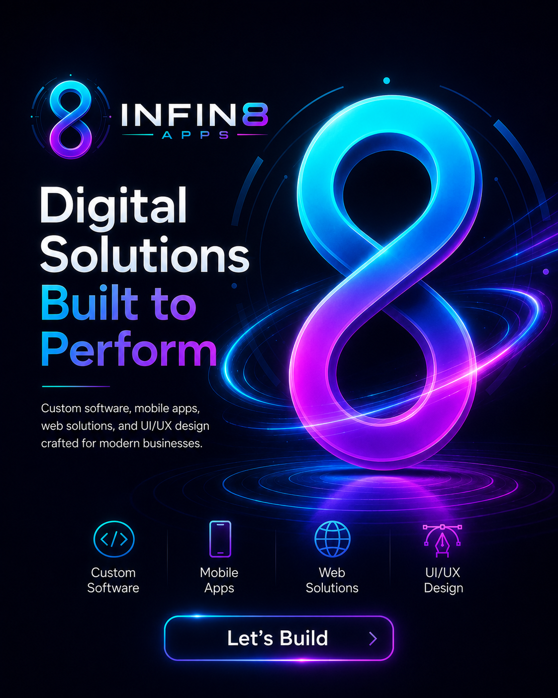
  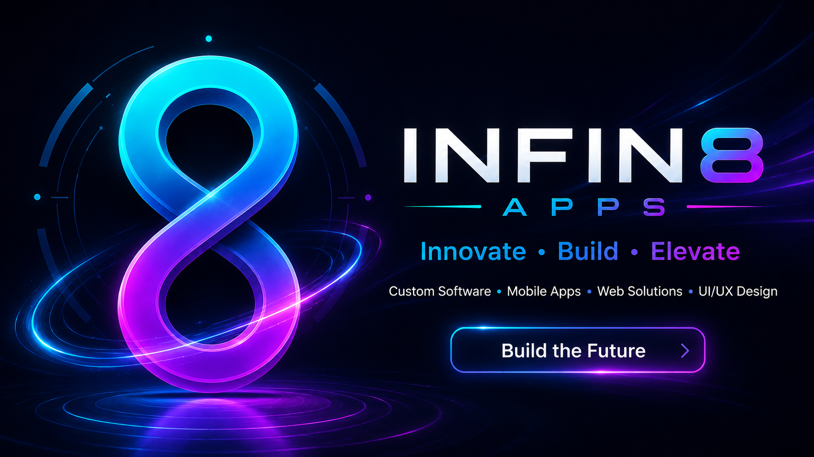

# Hi, I'm Jaco

### Product engineer · Local AI systems · Creative software · Web gaming

  <a href="http://infin8apps.infinityfree.io">
    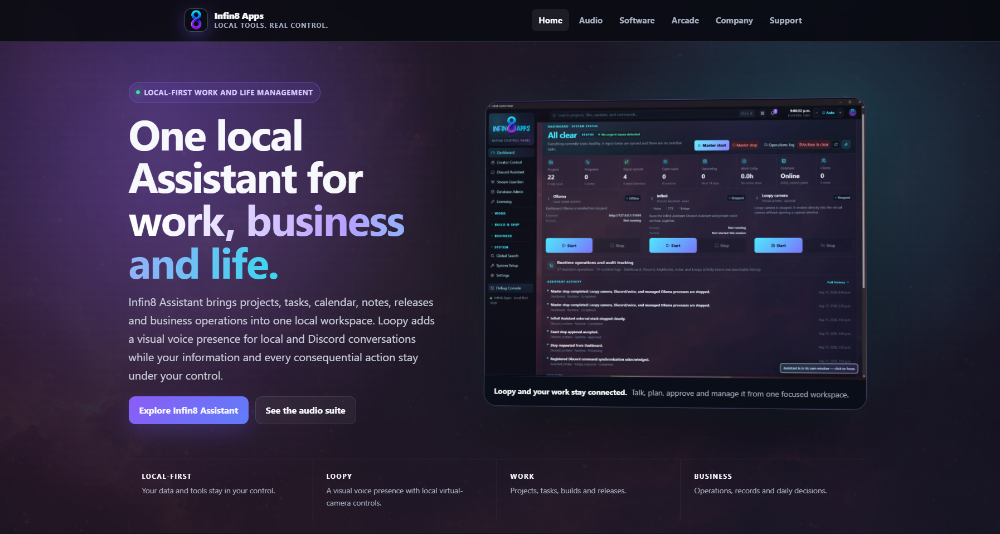
  </a>

  <strong><a href="https://infin8apps.infinityfree.io">Explore the Infin8 Apps ecosystem</a></strong> 
  Infin8 Assistant is now the primary platform for product direction, with Fin
  as its interactive companion. Other software suites are now secondary and
  integrated through this runtime where practical.
   <strong><a href="https://infin8apps.infinityfree.io/games/">Play Infin8 Arcade — free in your browser</a></strong>

I design local-first products that combine native performance, practical AI,
thoughtful interfaces, real user control, and safe automation.

[Featured work](#featured-work) · [Skills](#skills-and-engineering-focus) ·
[Current focus](#what-im-building-now) · [Connect](#lets-connect)

---

## Building useful software from idea to validated product

I build under **Infin8 Apps**, with hands-on ownership across product design,
architecture, implementation, testing, packaging, and technical presentation.
The current Infin8 Apps ecosystem is led by Infin8 Assistant for local work,
business, and personal management; Infin8 Audio Chain with six focused Audio
products; focused
Windows applications for creation and diagnostics; and Infin8 Arcade games
with shared profiles, progression, controls, and leaderboards.

The common goal is simple: turn technically difficult workflows into software
that people can understand, control, and use on their own computers.

| Area | What I build |
| --- | --- |
| **Local AI** | Private assistants, voice conversations, tool use, project knowledge, speech recognition, and local model orchestration. |
| **AI video systems** | AI-assisted editing, format adaptation, timeline automation, YOLO detection/tracking, and locally optimized `.pt`, `.onnx`, and TensorRT `.engine` inference. |
| **Realtime audio** | Native DSP, voice transformation, vocal production, pitch processing, MIDI, metering, and standalone/VST3 delivery. |
| **Web gaming & community** | Free browser games, shared player profiles, score tracking, leaderboards, control profiles, progression, and multiplayer lobbies. |
| **Windows products** | C++, Rust, Qt, Tauri, Electron, React, Python, WebView2, local services, packaging, and hardware-aware tools. |

> **Open to:** product-engineering opportunities, technical collaboration,
> private demonstrations, partnerships, and investment conversations.

## Featured work

### Infin8 Assistant — Voice-Driven AI Business Operations

  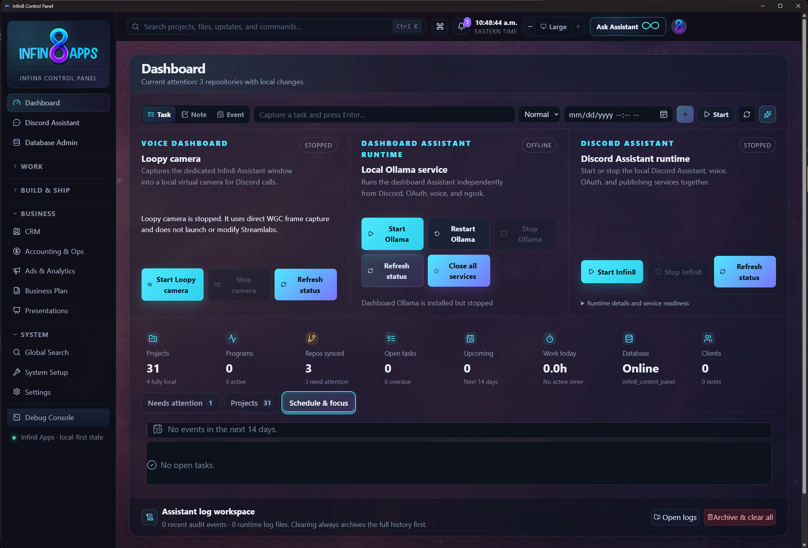

Infin8 Assistant is the flagship platform for Infin8’s development and operational layer.
It is a local AI control surface that turns natural-language and voice requests into
real, approval-gated operations inside the Infin8 Development Control Panel.

  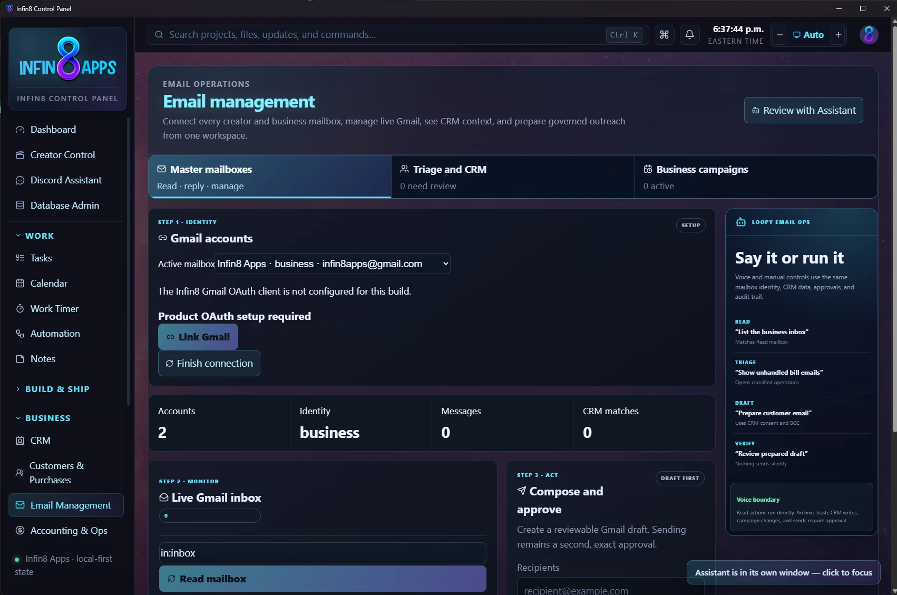
  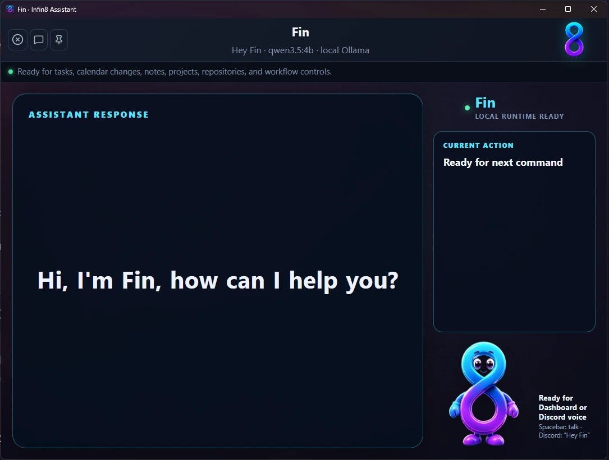

Business management is part of that surface rather than a separate tool: the assistant
reads and triages connected mail by voice, drafts replies against real customer records,
and holds every send behind the same approval gate as any other operation. Fin is the
face of it, reporting what the assistant is doing while it works.

### Fin — The Visual Voice of Infin8 Assistant

  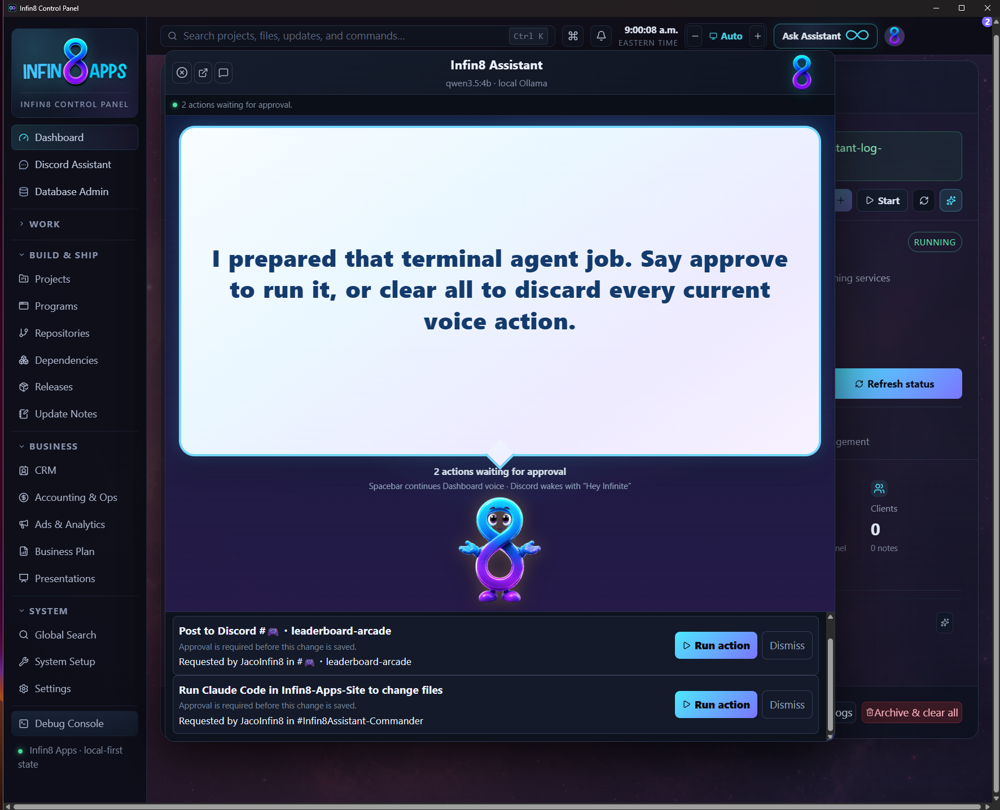

Fin gives Infin8 Assistant a clear interaction layer for voice workflows, approvals,
and Discord runtime visibility. The characterized status flow keeps users informed of
assistant state while all consequential actions remain review-gated and auditable.

### Infin8 Arcade — free browser gaming, leaderboards, and multiplayer

  <a href="https://infin8apps.infinityfree.io/games/">
    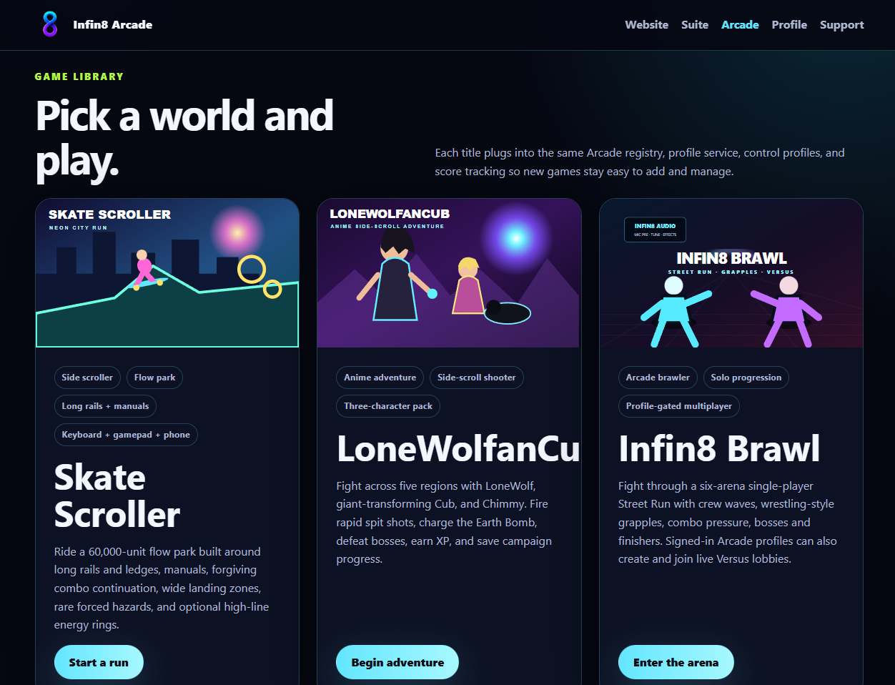
  </a>

  <a href="https://infin8apps.infinityfree.io/games/">
    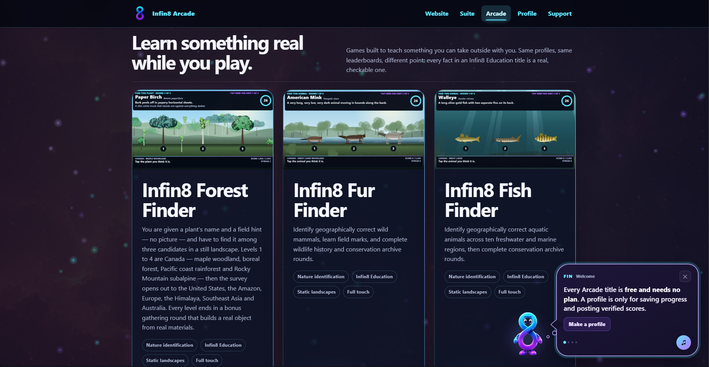
  </a>

**Infin8 Arcade is the community and discovery layer of the Infin8 Apps website:**
a growing collection of original games that are free to play directly in the
browser, designed to bring players back through progression, competition, and
multiplayer while introducing more people to the wider Infin8 Apps ecosystem.

The Arcade uses shared player profiles, cross-device progression, customizable
control profiles, per-game and per-level leaderboards, top-player cards, and
verified score submission rather than operating as isolated demos. Signed-in
profiles provide persistent identity for competitive features and live lobbies.

Current games include:

**Infin8 Arcade**

- **Infin8 Sk8er** — ride ten progressively longer themed terrain builds with
  long rails and ledges, manuals, forgiving combo continuation, wide landing
  zones, rare forced hazards, and optional high-line energy rings.
- **LoneWolfanCub** — an anime-inspired 2D side-scroll shooter/adventure with
  LoneWolf, giant-transforming Cub, and Chimmy across ten regions, timed level
  weapons, a different boss in every region, XP, and campaign progression.
- **Infin8 Brawler** — fight through a ten-arena Street Run with distinct
  terrain, crew archetypes, hazards, wrestling-style grapples, combo pressure,
  bosses, finishers, and profile-gated live Versus lobbies.
- **Infin8 Exploder** — swap and match bright symbols to trigger chain
  explosions across ten escalating puzzle levels with stricter time windows,
  deeper cascade pressure, and full and per-level leaderboards.

**Infin8 Education**

- **Infin8 Forest Finder** — identify plants from their names and field hints
  across ten global regions, then complete bonus gathering rounds that build
  real objects from real materials.
- **Infin8 Fur Finder** — identify geographically correct wild mammals, learn
  their field marks, and complete wildlife history and conservation archive
  rounds.
- **Infin8 Fish Finder** — identify geographically correct aquatic animals
  across ten freshwater and marine regions, then complete conservation archive
  rounds.

  <strong><a href="https://infin8apps.infinityfree.io/games/">▶ Play Infin8 Arcade free</a></strong>

### Infin8 Audio — one controlling Chain and six focused products

Infin8 Audio Chain is the top-level standalone control surface for the complete
Audio system. It owns audio and MIDI devices once, hosts all six product engines
across serial, parallel, generator, and analyzer paths, coordinates tempo and
safe monitoring, and records the compensated master. It is included in the
Infin8 Audio tier and can open each product's full interface without giving up
control of the running session.

  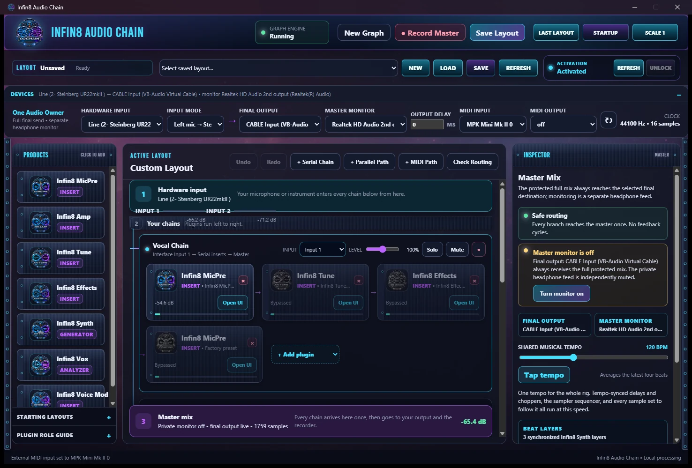

The six focused products use native realtime processing, embedded interfaces,
persistent state, shared licensing, and repeatable standalone/VST3 packaging.
Infin8 Voice Mod is the standalone voice-transformation workspace; the other
five products also ship as VST3 plugins.

<table>
  <tr>
    <td width="50%" valign="top">
      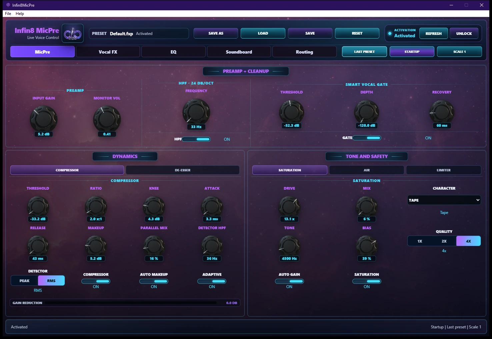
      <h3>Infin8 MicPre</h3>
      
<strong>A complete vocal front end in one workspace.</strong>

      
Combines gain staging, cleanup, dynamics, tone shaping, output safety,
      vocal effects, parametric EQ, and a performance soundboard for music,
      streaming, podcasting, and voiceover.

      
<strong>Engineering:</strong> realtime C++ DSP, iPlug2, WebView2,
      MIDI, metering, host automation, preset state, licensing, and
      standalone/VST3 delivery.

    </td>
    <td width="50%" valign="top">
      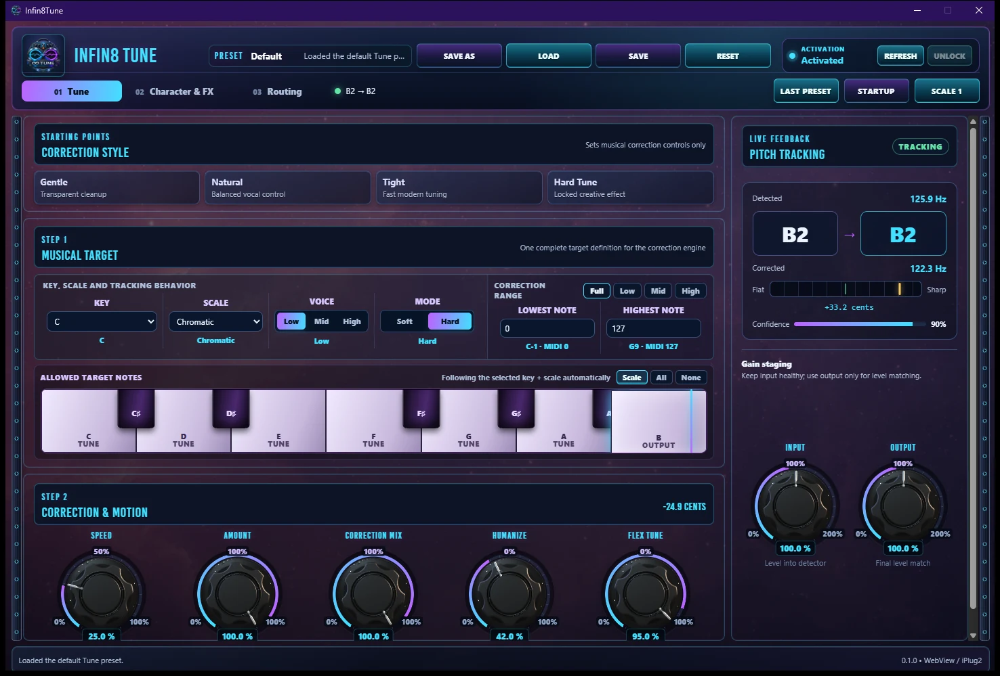
      <h3>Infin8 Tune</h3>
      
<strong>Realtime vocal correction with musical control.</strong>

      
Provides key-and-scale targeting, correction character, pitch-motion
      controls, live tracking feedback, vocal effects, and flexible monitoring
      for performance and studio use.

      
<strong>Engineering:</strong> realtime pitch analysis and correction,
      C++ DSP, iPlug2, WebView2, automation, metering, preset recall, and
      standalone/VST3 delivery.

    </td>
  </tr>
  <tr>
    <td width="50%" valign="top">
      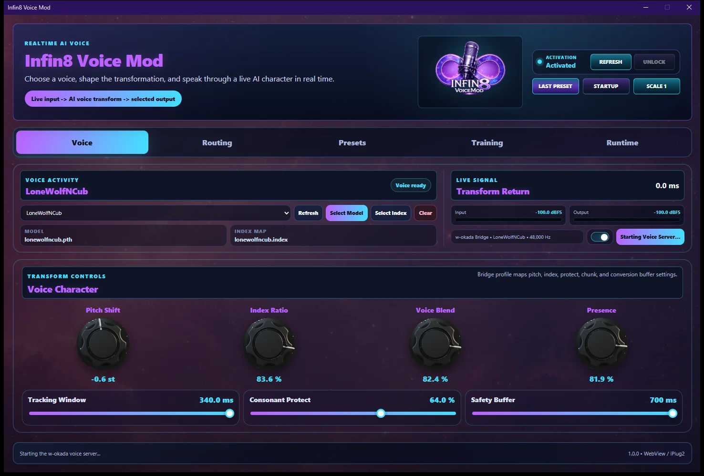
      <h3>Infin8 Voice Mod</h3>
      
<strong>Realtime voice transformation with a complete local workflow.</strong>

      
Turns trained voice packages into a usable production system with
      voice-library management, conversion controls, device routing, presets,
      runtime configuration, telemetry, and assisted model training.

      
<strong>Engineering:</strong> native C++ host, iPlug2, WebView2, RVC,
      PyTorch and ONNX runtimes, GPU profiles, device fallback, content
      packaging, and shared licensing.

    </td>
    <td width="50%" valign="top">
      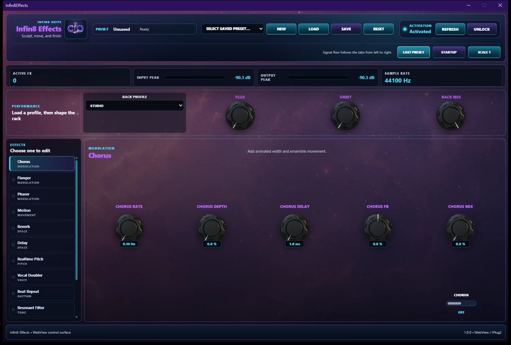
      <h3>Infin8 Effects</h3>
      
<strong>Sculpt, move, and finish sound in one effects environment.</strong>

      
Brings dynamics, saturation, limiting, modulation, space, delay, and
      an eight-band parametric EQ into a clear creative signal chain.

      
<strong>Engineering:</strong> modular realtime C++ DSP, iPlug2,
      WebView2, host automation, visual metering, preset serialization, and
      standalone/VST3 delivery.

    </td>
  </tr>
  <tr>
    <td width="50%" valign="top">
      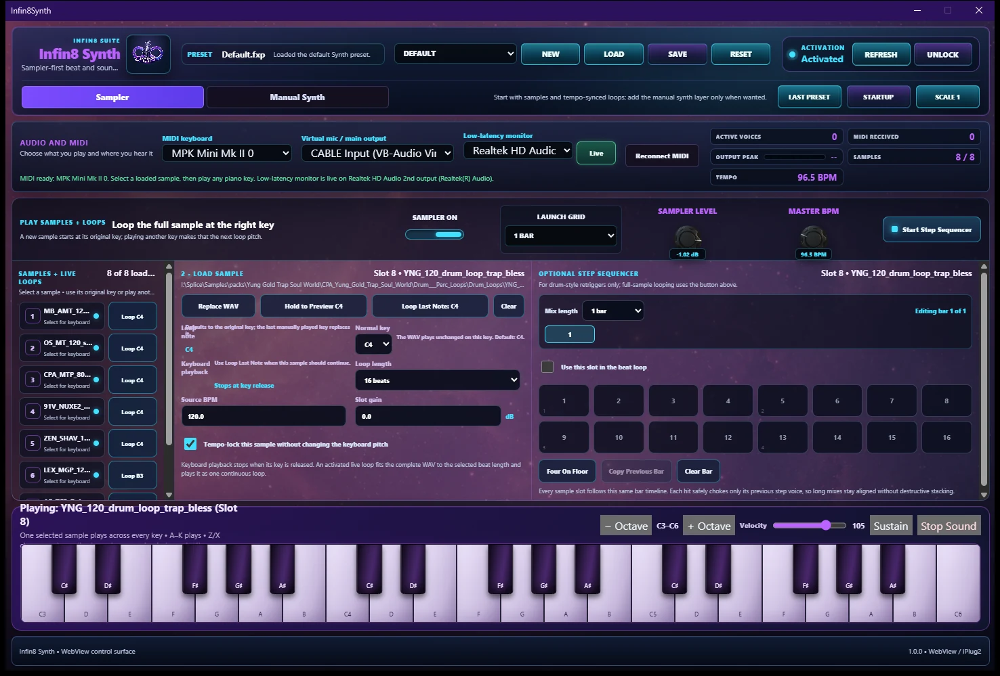
      <h3>Infin8 Synth</h3>
      
<strong>Synthesis, chromatic sample playback, and tempo-aware performance in one instrument.</strong>

      
Combines oscillators, filtering, envelopes, modulation, a playable keyboard,
      and a selected-sample layer that follows the current session.

      
<strong>Engineering:</strong> realtime C++ DSP, iPlug2, WebView2,
      MIDI, host tempo, automation, persistent state, and standalone/VST3 delivery.

    </td>
    <td width="50%" valign="top">
      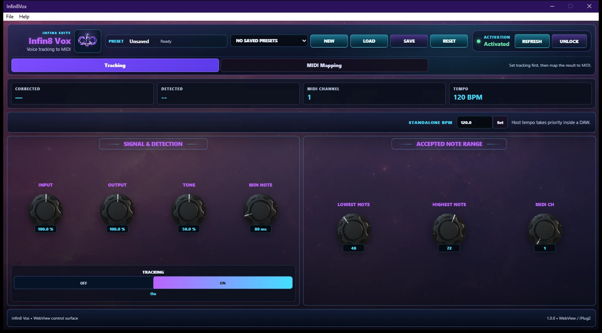
      <h3>Infin8 Vox</h3>
      
<strong>Turn singing and humming into playable MIDI expression.</strong>

      
Tracks voice pitch inside a defined note range and routes the result to a
      selected MIDI channel for instruments, production, and live workflows.

      
<strong>Engineering:</strong> realtime pitch detection, MIDI generation,
      C++ DSP, iPlug2, WebView2, host tempo, and standalone/VST3 delivery.

    </td>
  </tr>
</table>

### Developed Infin8 Apps products

<table>
  <tr>
    <td colspan="2" width="100%" valign="top">
      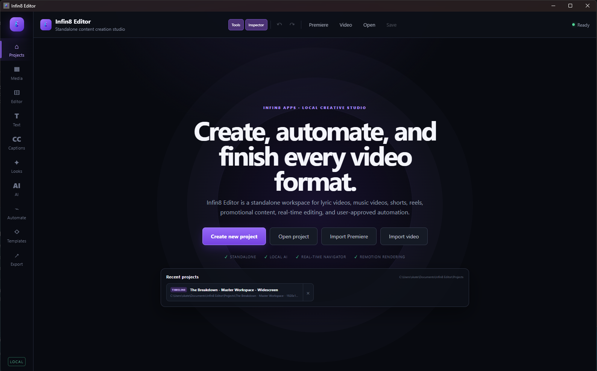
      <h3>Infin8 Editor — AI-Assisted Video Creation Studio</h3>
      
<strong>Create, adapt, and finish widescreen and social video from one
      local-first editing workspace.</strong>

      
Infin8 Editor combines a multitrack timeline, video and Premiere
      project import, smart media relinking, captions, titles, looks, audio
      controls, live preview, project persistence, and H.264 export. Canvas
      presets support 16:9 widescreen, portrait shorts, vertical reels, square
      posts, lyric videos, music videos, and promotional content.

      
Its AI layer can use local Ollama or an optional OpenAI connection to
      plan first cuts and apply validated, undoable timeline commands. Imported
      Premiere projects are never overwritten and generated code is never
      executed.

      
<strong>Built with:</strong> Electron, React, TypeScript, Remotion,
      Mediabunny, Ollama, optional OpenAI assistance, Premiere migration,
      sandboxed media handling, and deterministic rendering.

    </td>
  </tr>
  <tr>
    <td colspan="2" width="100%" valign="top">
      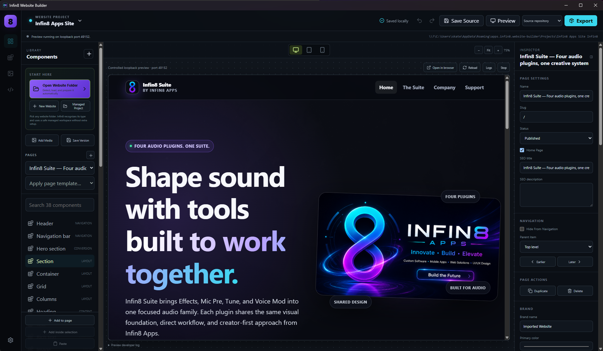
      <h3>Infin8 Website Editor — Visual Website Reconstruction Studio</h3>
      
<strong>Open real website folders, preserve their design, and evolve
      them through a controlled local editing workflow.</strong>

      
Infin8 Website Editor loads existing website repositories as editable
      digital twins while preserving hierarchy, CSS, media, fonts, responsive
      rules, navigation, and filenames. Direct selection, movement, resizing,
      keyboard text editing, exact property controls, preview, backup,
      validation, source saving, and deployment export share one authoritative
      document state.

      
<strong>Built with:</strong> Tauri, Rust, React, TypeScript, HTML/CSS
      project analysis, component modelling, responsive preview, local
      filesystem access, automated quality gates, and standalone Windows
      packaging.

    </td>
  </tr>
  <tr>
    <td colspan="2" width="100%" valign="top">
      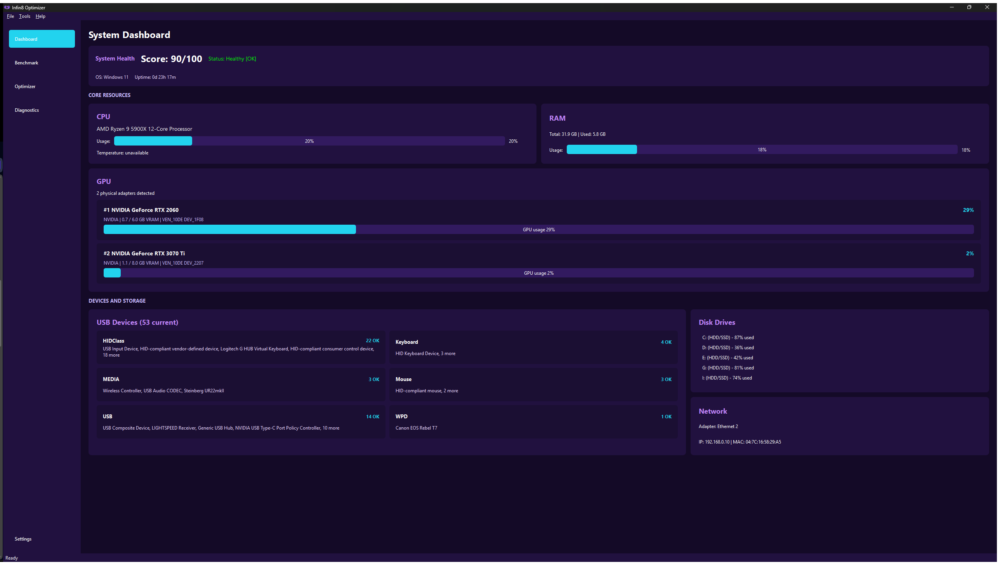
      <h3>Infin8 Optimizer — Windows Performance and Diagnostics</h3>
      
<strong>Understand the PC, verify its condition, and make bounded
      performance improvements from one native workspace.</strong>

      
Infin8 Optimizer combines hardware visibility, diagnostics, guarded
      cleanup, benchmarks, and guided optimization with clear evidence and
      recovery boundaries.

      
<strong>Built with:</strong> C++17, Qt 6, CMake, Windows APIs,
      Direct3D 11, PowerShell, and repeatable validation.

    </td>
  </tr>
  <tr>
    <td colspan="2" width="100%" valign="top">
      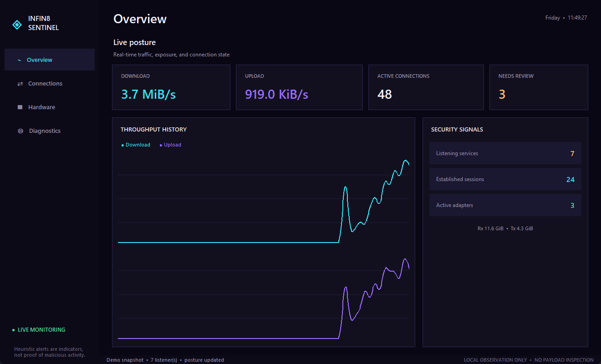
      <h3>Infin8 Sentinel — Network and Process Intelligence</h3>
      
<strong>Explain local network activity, process ownership, protected
      routes, stability, and security signals without inspecting private
      payloads.</strong>

      
Sentinel correlates throughput, ports, service purpose, network scope,
      process and resource pressure, active local networks, adapter health,
      DNS, and outbound routes. Findings remain plain-language, evidence-backed,
      and careful not to present heuristics as proof of malicious activity.

      
<strong>Built with:</strong> Python, psutil, PySide6 Essentials through
      its free open-source license route, IPv4/IPv6 analysis, protected-route
      policy, threaded diagnostics, CLI/JSON integration, and automated tests.

    </td>
  </tr>
</table>

## Skills and engineering focus

| Focus | Practical experience |
| --- | --- |
| **Product engineering** | Product definition, UX, architecture, implementation, integration, testing, packaging, release workflows, and technical communication. |
| **Local AI systems** | Ollama, llama.cpp, speech-to-text, text-to-speech, RVC voice conversion, model/runtime health checks, GPU profiles, local memory, and approval-gated tools. |
| **AI video and computer vision** | Remotion-based video systems, MediaPipe, TensorFlow Lite, EfficientDet, YOLO detection/tracking, PyTorch tensor pipelines, CUDA acceleration, ONNX portability, and TensorRT deployment. |
| **Realtime audio** | Modern C++, DSP, pitch analysis, MIDI, low-latency routing, metering, preset state, iPlug2, VST3, and standalone applications. |
| **Desktop and web UI** | Qt 6, PySide6/PyQt6, Tauri, Rust, Electron, React, TypeScript, Vite, WebView2, and accessible operational interfaces. |
| **Gaming & community systems** | Browser game architecture, shared profiles, score persistence, leaderboards, progression systems, multiplayer lobbies, and reusable control/game registries. |
| **Windows integration** | Process and registry APIs, audio devices, GPU-aware workloads, local HTTP services, PowerShell automation, installers, and self-contained packaging. |
| **Safe automation** | Human approval, source-copy workflows, undoable edits, paper modes, dry runs, bounded scans, validation gates, logs, and recoverable outputs. |

Customer-facing Infin8 interfaces use an Infin8-owned design system with shared
texture, transparency, accessibility, and operational-clarity rules. UI
frameworks, themes, and component libraries must remain free to use for
commercial Infin8 products; paid UI systems, subscriptions, royalties, trials,
watermarks, revenue caps, and paid feature gates are not adopted.

### Local AI-video model pipeline

I have worked with Torch and PyTorch tensor pipelines, CUDA GPU acceleration,
PyTorch `.pt` models, exported and integrated ONNX `.onnx` models, and created
TensorRT `.engine` files optimized for the available local GPU hardware. These
model formats support low-latency video programming and YOLO-based detection
and tracking without requiring footage to leave the local machine.

I apply the resulting detections as structured, reviewable data for product
and inventory recognition, work-system records, operational analysis, and
security-event review. The emphasis is on local processing, traceable results,
bounded retention, and human control over how detections are stored or used.

### Technology

  
  
  
  
  
  
  
  
  
  
  
  

`Ollama` · `llama.cpp` · `Whisper` · `Kokoro` · `Torch tensors` · `PyTorch .pt` ·
`CUDA` · `ONNX .onnx` · `TensorFlow Lite` · `TensorRT .engine` · `YOLO` ·
`MediaPipe` · `EfficientDet` ·
`CTranslate2` · `Demucs` · `RVC` · `Remotion` · `Mediabunny` ·
`HTML/CSS project analysis` · `iPlug2` ·
`VST3` · `WebView2` · `SQLite` · `CMake` · `PowerShell`

## What I'm building now

- Expanding **Infin8 Arcade** as a fully free gaming destination for the Infin8
  Apps website, with original games, persistent profiles, leaderboards,
  progression, multiplayer lobbies, and community-driven repeat visits.
- Advancing **Infin8 Assistant** into a voice-driven operational layer for the
  business, connecting AI conversations to real Control Panel tools and
  approval-gated actions.
- Advancing Infin8 Audio Chain as the top-level host for MicPre, Tune, Voice Mod,
  Effects, Synth, and Vox.
- Expanding Infin8 Editor across widescreen and social-video production.
- Developing Infin8 Website Editor for faithful visual editing of existing
  websites, direct canvas controls, and controlled production export.
- Developing Infin8 Sentinel into a plain-language network and process
  intelligence hub for local networks, protected development/service routes,
  stability, performance, and security review.
- Expanding YOLO detection and tracking through locally built `.pt`, `.onnx`,
  and hardware-optimized TensorRT `.engine` pipelines for video, inventory,
  work-system, and security applications.
- Turning specialized creative workflows into understandable, repeatable,
  validated Windows products. Release packages are produced only when a product
  is finished for that release and a release is explicitly requested.

## Portfolio access

The product portfolio is maintained as a private presentation and technical
review suite rather than a public source dump. For qualified employer, partner,
or investor conversations, I can provide guided demonstrations, architecture
walkthroughs, selected source review, and deeper product case studies.

## Let's connect

If you are building ambitious desktop software, local AI systems, creative
tools, audio products, or intelligent automation, I would be glad to talk.

  

  <strong>Product demonstrations · Engineering opportunities · Partnerships · Investment</strong>

---

  Designed and engineered by <strong>JacoInfin8</strong> 
  Copyright © 2026 JacoInfin8. All rights reserved.

